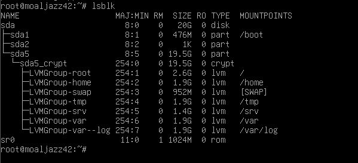

# Born2beRoot - System Administration
This project was a solo exercise to install and configure a secure Debian Linux server from the command line in a virtual machine.

### Screenshot

    

My tasks included:

Hardening the server by setting up a firewall (UFW), strict password policies, and a secure sudo configuration.

Moving the SSH service to a non-standard port and disabling root login.

Partitioning the disk and setting up LVM (Logical Volume Management) with encryption.

Writing a Bash script (monitoring.sh) to monitor system health.

Technologies: Linux (Debian), VirtualBox, LVM, UFW, SSH, Bash Scripting
